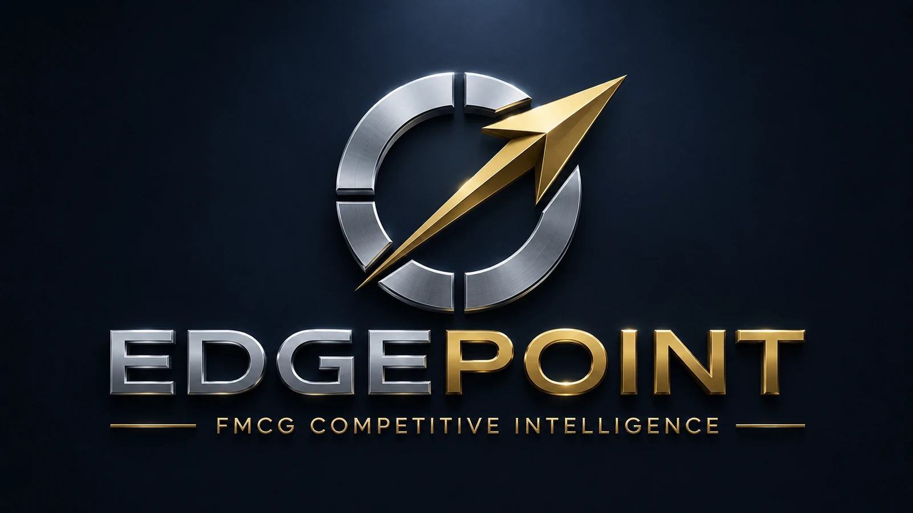
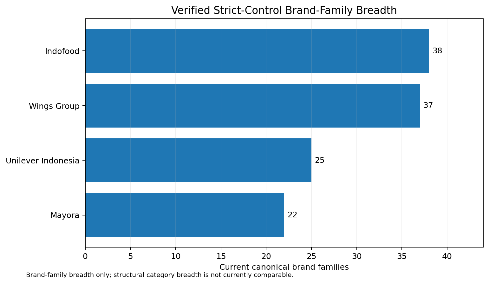
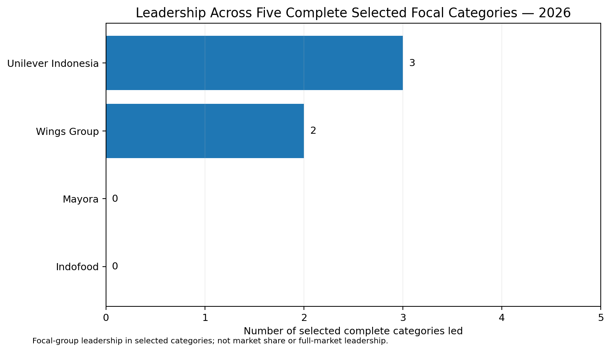
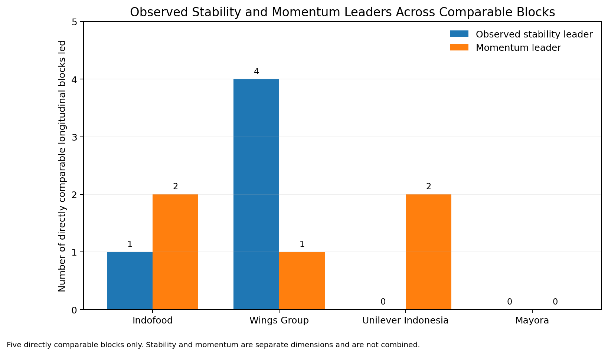
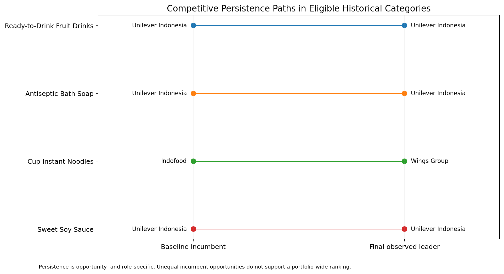
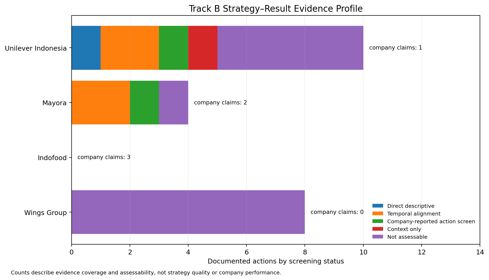
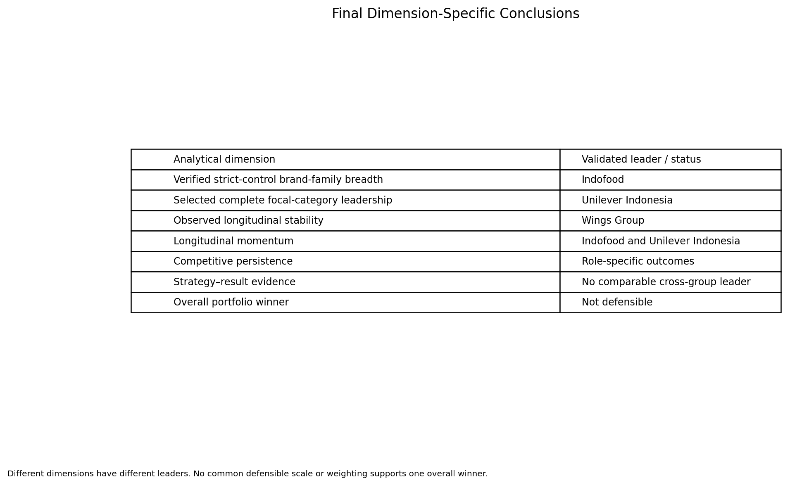

# Portfolio Power: Which FMCG Group Wins Across Indonesia's Consumer Market?



A comparative analysis of the brand portfolios of **Wings Group, Indofood, Mayora, and Unilever Indonesia** across Indonesia's consumer market.

The project evaluates portfolio strength through separate evidence dimensions rather than forcing unlike metrics into a single score. It combines verified ownership and brand-family breadth, selected category leadership, longitudinal stability, momentum, competitive persistence, and a bounded review of documented business actions against compatible company results.

> **Overall assessment:** there is no single FMCG group that leads every defensible dimension. Indofood leads verified strict-control brand-family breadth; Unilever Indonesia leads the selected complete 2026 focal-category snapshot; Wings Group leads observed longitudinal stability; Indofood and Unilever Indonesia share momentum leadership; competitive persistence is role-specific; and current strategy-result evidence is not comparable enough to support a cross-group strategy-effectiveness ranking. A universal overall winner is therefore not defensible without imposing an unsupported common scale and post hoc weighting.

---

## Reports

| Document | Description |
|---|---|
| [Full Report - Indonesian PDF](docs/Portfolio_Power_Indonesia_FMCG_Portfolio_ID.pdf) | Complete Indonesian report covering Chapters I-VII, references, and Appendices A-F. |
| [Full Report - English PDF](docs/Portfolio_Power_Indonesia_FMCG_Portfolio_EN.pdf) | Complete English report with the same analytical structure, findings, figures, references, and appendices. |

Both PDFs use **AES-256 permission encryption**. They open without a reader password and allow printing, while compliant PDF viewers restrict copying, extraction, modification, assembly, and related editing operations. These controls reduce casual alteration but cannot prevent screenshots, OCR, or tools that ignore PDF permissions.

---

## Results at a Glance

The evidence does not support one universal definition of portfolio strength. Different groups lead different dimensions.

| Dimension | Validated result | Interpretation boundary |
|---|---|---|
| Verified strict-control brand-family breadth | **Indofood: 38**, Wings Group: 37, Unilever Indonesia: 25, Mayora: 22 | Brand-family breadth is not structural category breadth, market share, or sales strength. |
| Selected complete focal-category leadership, 2026 | **Unilever Indonesia: 3 of 5**, Wings Group: 2 of 5 | This is focal-group leadership in five selected complete categories, not full-market leadership or market share. |
| Observed longitudinal stability | **Wings Group: 4 of 5 comparable blocks**; Indofood: 1 of 5 | Stability measures lower period-to-period variation inside eligible blocks; stability is not the same as strength. |
| Momentum | **Indofood: 2 of 5; Unilever Indonesia: 2 of 5**; Wings Group: 1 of 5 | Net TBI change is interpreted within each category block and is not averaged across categories. |
| Competitive persistence | Unilever retains **3 of 3** observed incumbent opportunities; Indofood retains **0 of 1**; Wings records **1 challenger takeover** | Opportunity counts and competitive roles differ, so no portfolio-wide persistence ranking is produced. |
| Consumer reach | Not comparable for a four-group ranking | Public Brand Footprint evidence does not provide one complete, common source-native universe across the focal groups and periods. |
| Portfolio concentration | Not eligible | Performance-weighted concentration is not calculated from non-additive TBI, ordinal ranks, or selective public reach facts. |
| Strategy-result evidence | No comparable cross-group leader | Evidence availability and assessability are not measures of strategy quality or performance. |
| Overall winner | **Not defensible** | No common defensible scale or pre-specified weighting exists across the eligible dimensions. |

---

## Analytical Questions

The project asks:

1. Which group has the broadest verified brand portfolio under a strict-control ownership definition?
2. Is portfolio strength concentrated in a few brands, or does it appear through leadership across multiple selected categories?
3. Which group most often produces category leaders or strong positions in comparable snapshots?
4. Which group is most consistent over time in eligible longitudinal blocks?
5. Which group is most persistent as an incumbent, and where does a challenger successfully take over?
6. How can documented business actions be read alongside company results without exceeding attribution, geography, ownership, or reporting-perimeter boundaries?
7. Can the dimensions be combined defensibly into one overall winner?

---

## Evaluation Framework

The final assessment keeps the major dimensions separate.

| Dimension | Question answered |
|---|---|
| Portfolio breadth | How many current canonical brand families are verified within the strict-control perimeter? |
| Selected category leadership | Which focal group has the highest source-native TBI in complete selected category snapshots? |
| Longitudinal stability | Which eligible brand series shows the lowest mean absolute period-to-period TBI change within a comparable block? |
| Momentum | Which eligible brand series records the highest net TBI change inside its own category-period block? |
| Competitive persistence | Does an incumbent retain leadership, or does a challenger take over, when an eligible opportunity exists? |
| Strategy-result evidence | How strongly can a documented action be paired with a compatible observable result? |

The project does **not** normalize these dimensions, create an overall composite score, average TBI across categories, convert ranks into interval-scale performance, or substitute missing observations with zero.

---

## Ownership and Portfolio Perimeter

Brand attribution is evaluated at the observation or reference period rather than through general brand association.

- **Wings Group:** verified group-level controlled portfolio is eligible for primary breadth; explicit joint ventures such as PT Lion Wings, PT Glico Wings, and PT Calbee Wings do not receive full strict-control credit.
- **Indofood:** the primary consumer-facing perimeter includes Consumer Branded Products, relevant Bogasari consumer flour brands, and relevant Agribusiness consumer edible oils/fats; distribution, upstream, and industrial-only activities remain context.
- **Mayora:** the primary perimeter covers PT Mayora Indah Tbk and consolidated subsidiaries. PT Tirta Fresindo Jaya is treated as a related-group affiliate; Le Minerale is sensitivity-only rather than primary strict-control credit.
- **Unilever Indonesia:** ownership is time-varying. The Ice Cream business ended on 8 December 2025 and SariWangi ended on 2 March 2026 for the ownership treatment used here; later outcomes do not carry those disposed businesses forward.

The ownership framework also prevents double counting of parent brands, sub-brands, variants, and pack formats when the analytical unit is the canonical brand family.

---

## Metric Semantics and Comparability

Several sources describe different constructs and are not pooled onto one scale.

- **Top Brand Index (TBI)** is treated as a source-native survey index, not market share or revenue share.
- **Brand rank** is ordinal and is not treated as an interval-scale performance difference.
- **Consumer Reach Points, penetration, purchase frequency, and Brand Footprint rank** are not relabelled as revenue or market share.
- **Direct-store coverage** is interpreted as distribution availability, not consumer reach, purchase, sales impact, or profitability.
- **Sales, operating profit, and margins** retain their reporting perimeter and are not automatically attributed to a brand, category, strategy, or Indonesian household demand.
- Missing or unavailable observations remain missing; they are not replaced with zero, silently interpolated, or carried forward.

Comparability is classified as `directly_comparable`, `comparable_with_transformation`, `comparable_with_caveat`, `context_only`, or `not_comparable` before synthesis.

---

## Methodology

The analytical workflow consists of:

1. **Ownership and brand-universe definition**  
   Verify brand-group relationships, ownership periods, joint ventures, affiliates, former portfolios, and context-only records before performance attribution.

2. **Source acquisition and provenance control**  
   Register source identity, publisher, period, geography, methodology, access and redistribution conditions, retrieval details, and analytical use.

3. **Observation standardization**  
   Preserve source-native metrics, category/subcategory identity, methodology clusters, ownership validity, missingness, and attribution scope.

4. **Eligibility and comparability screening**  
   Build explicit denominators and allow longitudinal or cross-group analysis only when identity, period, category, methodology, and ownership rules are satisfied.

5. **Track A - portfolio performance**  
   Evaluate verified breadth, selected category leadership, longitudinal stability, momentum, competitive persistence, and pre-specified ownership sensitivity.

6. **Track B - strategy and company results**  
   Evaluate `documented action -> intended mechanism -> observable result -> temporal/scope alignment -> evidence strength` without converting temporal alignment or management explanation into independent causality.

7. **Cross-track synthesis**  
   Combine conclusions rather than incompatible values. The overall-winner gate requires a defensible common scale and pre-specified weighting; those conditions are not met.

8. **Final validation and visualization**  
   Reconcile final dimension leaders, evidence boundaries, ownership treatment, figure specifications, and finding traceability before publication.

---

## Key Findings

| ID | Finding | Evidence role |
|---|---|---|
| FND01 | **Indofood leads verified strict-control brand-family breadth** with 38 canonical brand families, narrowly ahead of Wings Group at 37. | Track A - breadth |
| FND02 | **Unilever Indonesia leads the selected complete focal-category snapshot** with 3 of 5 leadership events in 2026; Wings Group leads 2 of 5. | Track A - selected category leadership |
| FND03 | **Stability and momentum identify different strengths.** Wings Group leads observed stability in 4 of 5 comparable blocks; Indofood and Unilever Indonesia each lead momentum in 2 of 5. | Track A - longitudinal |
| FND04 | **Persistence separates incumbent retention from challenger takeover.** Unilever retains 3 of 3 observed incumbent opportunities, while Wings records one challenger takeover in cup instant noodles. | Track A - persistence |
| FND05 | **Mayora's Le Minerale sensitivity does not change the primary breadth conclusion.** Including it raises Mayora from 22 to 23 brand families, while its breadth rank remains fourth. | Track A - sensitivity |
| FND06 | **Wings strategy evidence is constrained by compatible-result disclosure.** Eight documented actions remain not assessable at the action-result level; this is an evidence limitation, not a negative performance result. | Track B - Wings boundary |
| FND07 | **Indofood and ICBP performance explanations remain company-reported.** Observable financial results do not independently identify the integrated model, volume, or productivity as causal drivers. | Track B - Indofood boundary |
| FND08 | **Mayora supports bounded temporal and company-reported interpretation.** Innovation, pricing, sourcing, sales, and operating-profit evidence remains limited by attribution, mixed geography, and material input-cost alternatives. | Track B - Mayora boundary |
| FND09 | **Unilever provides the only direct descriptive strategy-result pair in the governed action set.** Sunlight's Q1 2025 launch had reported coverage above 70% of direct stores, but that result is distribution availability - not sales, market share, reach, profitability, or causal effectiveness. | Track B - Unilever boundary |
| FND10 | **One overall winner remains not defensible.** The dimension leaders differ and the evidence does not support a common cross-dimensional scale or post hoc composite ranking. | Cross-track synthesis |

---

## Selected Analytical Results

### Breadth: Indofood leads by one brand family

The verified strict-control breadth result is:

- **Indofood: 38** canonical brand families;
- **Wings Group: 37**;
- **Unilever Indonesia: 25**; and
- **Mayora: 22**.

The Indofood-Wings difference is narrow. The result supports a breadth lead for Indofood within the verified universe, not a claim of broad market dominance. Structural category breadth is not calculated because comparable category mapping is incomplete across the full structural universe.



### Selected 2026 focal-category leadership: Unilever leads 3 of 5

Five selected 2026 categories provide a complete denominator for the focal comparison. Unilever Indonesia leads three: Ready-to-Drink Fruit Drinks through Buavita, Antiseptic Bath Soap through Lifebuoy, and Sweet Soy Sauce through Bango. Wings Group leads White Coffee through TOP White Coffee and Cup Instant Noodles through Mie Sedaap Cup.

The 3-of-5 and 2-of-5 counts are selected leadership events. They are **not** market-share percentages and do not establish full-market leadership.



### Stability and momentum lead to different winners

Across five eligible historical blocks, Wings Group is the observed-stability leader in four, while Indofood leads one. Momentum is split: Indofood and Unilever Indonesia each lead two blocks, while Wings Group leads one.

The result is intentionally not collapsed into one longitudinal score. Lower variation and stronger net change answer different questions.



### Competitive persistence is role-specific

Unilever Indonesia retains all three observed incumbent opportunities in the eligible opportunity set. Indofood does not retain its one observed incumbent opportunity. Wings Group has no baseline-incumbent opportunity in that set but records one challenger takeover in cup instant noodles.

Because roles and denominators differ, the project does not produce a portfolio-wide persistence ranking.



### Strategy-result evidence is sparse and asymmetric

Track B contains **22 documented actions** and **6 company-attribution claims**. At the action-screening level:

- 1 action has a direct descriptive pair;
- 4 are temporally aligned;
- 2 rely on company-reported attribution;
- 1 is context-only; and
- 14 are not assessable because a compatible result is unavailable at the required scope.

This profile measures evidence class and assessability, **not** strategy quality. A group with more directly assessable public evidence is not automatically a stronger performer or more effective strategist.



### Final dimensional answer

The final synthesis is deliberately dimension-specific:

- **Breadth:** Indofood;
- **Selected focal-category leadership:** Unilever Indonesia;
- **Observed stability:** Wings Group;
- **Momentum:** Indofood + Unilever Indonesia;
- **Competitive persistence:** role-specific, no portfolio-wide rank;
- **Strategy-effect ranking:** no comparable leader; and
- **Overall portfolio winner:** not defensible.



---

## Validation and Reproducibility

The final analytical consolidation is anchored to the committed analytical artifacts rather than the narrative report.

| Artifact | Purpose |
|---|---|
| [Final dimension summary](data/analytical/stage6f_final_dimension_summary.csv) | Canonical dimension-level leader or status used in the final report. |
| [Final findings](data/analytical/stage6f_final_findings.csv) | Ten evidence-linked final findings. |
| [Final evidence map](data/analytical/stage6f_final_evidence_map.csv) | Traceability from final findings to Track A, Track B, and final figures. |
| [Final validation](metadata/stage6f_validation.csv) | Forty final validation checks and the publication gate. |
| [Figure manifest](metadata/stage6f_figure_manifest.csv) | Final figure inventory and source-output mapping. |
| [Final consolidation notebook](notebooks/06f_visualization_final_findings_consolidation.ipynb) | Executed notebook producing the final consolidation and visual outputs. |

Final validation status:

- **13/13** governed inputs matched locked checksums;
- breadth reconciled to **38 / 37 / 25 / 22**;
- selected 2026 leadership reconciled to **Unilever 3 / Wings 2**;
- stability reconciled to **Wings 4 / Indofood 1**;
- momentum reconciled to **Indofood 2 / Unilever 2 / Wings 1**;
- **4** eligible incumbent opportunities retained for role-specific persistence interpretation;
- Track B reconciled to **22 actions / 6 company claims**;
- no TBI, rank, or distribution metric is relabelled as market share or consumer reach;
- no final finding claims causal identification;
- no normalization, weighting, or composite score is used; and
- final gate: **PASS_WITH_CAVEAT**, with **zero critical failures across 40 checks**.

---

## Important Limitations

- Public Top Brand and Brand Footprint coverage is selective and does not represent the full brand universe symmetrically.
- Historical Top Brand continuity cannot be fully independently verified; the 2022-2025 longitudinal blocks remain caveated and are not numerically bridged to the 2026 methodology cluster.
- Brand Footprint public evidence contains a material urban-to-national coverage break and only selected public facts.
- Wings Group has more limited compatible public result disclosure than listed companies; this disclosure gap is not treated as a performance gap.
- Indofood parent and ICBP results extend beyond Indonesian packaged household FMCG and include broader reporting perimeters and/or mixed geography.
- Mayora consolidated results combine domestic and export activity, while input-cost pressure is a material alternative explanation for financial movements.
- Unilever Indonesia has reporting-perimeter changes associated with the Ice Cream separation and the later SariWangi transfer.
- No causal identification is claimed. Even the strongest Sunlight case is a direct descriptive distribution pair and does not establish sales, market share, consumer reach, profitability, or superior strategy effectiveness.

---

## Repository Structure

The repository is organized around the reproducible analytical path:

```text
data/        source-derived, standardized, and analytical datasets
metadata/    provenance, eligibility, validation, manifests, and governance rules
notebooks/   executed analytical notebooks
outputs/     analytical figures and final visual outputs
assets/      public-facing repository imagery
docs/        secured public report PDFs
```

The project preserves a traceable path from **source -> ownership and metric governance -> standardized observations -> analytical outputs -> visualizations -> findings**.

---

## Interpretation Note

Company and brand names are used for identification and comparison only. This repository does not imply endorsement, affiliation, sponsorship, or approval by Wings Group, Indofood, Mayora, Unilever Indonesia, Frontier / Top Brand Award, Worldpanel by Numerator, or any other referenced organization.
